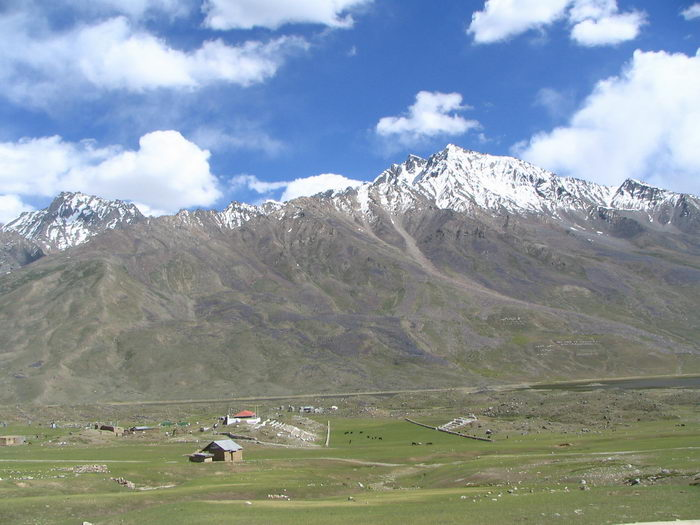

An arial view. The toughest polo matches in the world take place here - players go through 2-3 horses each through a game.

## Comments (3)

**Vadasz Siegfried** - February 23, 2007 11:02 PM

Hello Offroad Club members of the Karachi 4 X 4 Club,

i�ve found your Site by surching for something totally different, but i must admit that during my surfin on your Clubsite i forgot about what i was orininally looking after. I don�t remember how long i was looking picture after picture. I must admid that i never lost a thought about offroad sport or recreative "green laneing" in Pakistan.
I�m really impressed about your Site, it�s very informative and spiked with the most beautiful pictures i�ve seen for years.
I think you have a great country and offroading must be a real adventure in your country.

Dear Karachi Offroaders, keep on wheeling and smiling!

I wish all of you always about two fingers space under your diff

Kind Regards

Siegfried

**KO** - February 26, 2007 12:01 PM

Hi Siegfried,

Nice to hear from you! Glad you liked the site! Yes, offroading is quite an adventure here, the country is very beautiful!

Most of our jeeps are near stock height, so we don't always have "2 fingers space" under the diff - but thats what we aim for!

regards from all of us here,
ko

**Abdul Wali Khan Yaftali** - March 24, 2008  3:27 PM

This is the beautiful of picure of Shandur. Shandur is the highest pologround in the world. It is considered to be heaven for mountian tourism.
Abdul Wali Khan Yaftali

