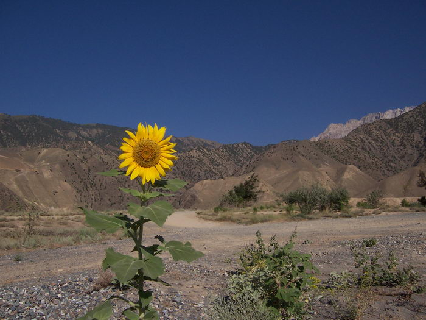

A solitary flower. The sunflower (Helianthus annuus) can grow up to 1 foot across. That could be a terrifying sight though. This one was about 3-4 inches or so across.

## Comments (1)

**Ameena Husain** - February 16, 2005  8:15 PM

I took this on our last day's early morning trek. It was just a few of us cousins that got up around 5am to go trekking. It was a beautiful morning and we got high enough to see an amazing view.

