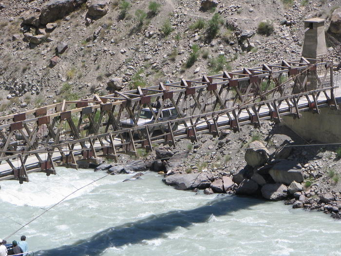

It was narrow enough that the sideview mirrors were touching both sides.

## Comments (3)

**Anil** - September 21, 2005  8:08 PM

Hi Guys,

Thanks for the posting, this site really helped in getting info for my Son's school project on Pakistan, great help really and an eye opener, just realised how beautiful and scenic our friendly neighbourhood country is, wow really.
Anil

**Naveed Zafar** - November 28, 2005  1:04 AM

Thats nice to see the pic and as well as the comment posted by Mr. Anil. Pakistan is one of the countries who have excellent sceneries but they are to be photographed YET. I Hope for the day Pakistan would be the center attraction for tourists of the whole world.

**DR A KHAN** - April 22, 2006  2:58 PM

thats also an eye opener for the people living in uk, i showed them to few of my staff members and they all are now making a trips with me to visit these places,:S:S i dont know how to get rid of them lol lol,

