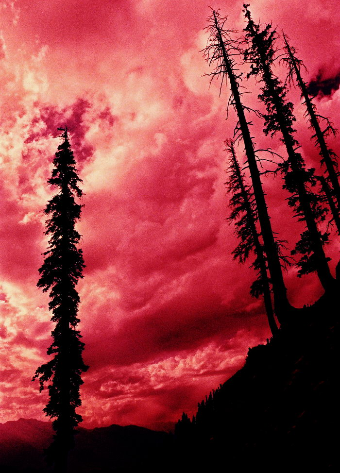

A long exposure on slide film gives some interesting results. Picture by AO.

## Comments (4)

**Mengal** - December 18, 2004  2:21 AM

AMAZINGGGGGGGGGGGGGGGGGGGGGGGGGGGGGGGGG i am in love with this another great shot of ya dude! Just lovely haaan

**manish sharma** - August  8, 2005  6:15 AM

Is that real ? Very nice.

**DR A KHAN** - April 22, 2006  2:51 PM

very nice piks, is it just a camera trick? was the trip too exhausting?

**Abid Omar** - April 23, 2006  2:13 PM

Slow exposure to caputre the details, followed up by cross-processsing.

