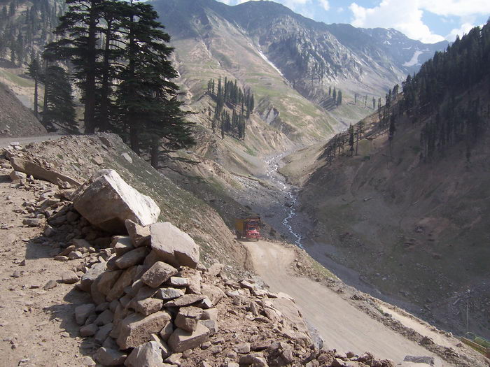

Slowing making it's way through the Lowari Pass.

## Comments (5)

**Satyasri Ukil** - September 17, 2005  2:00 AM

Pakistan indeed is a beautiful land!
I like your photographs.
Tell me, can Indians ever be allowed to visit such places?

**Noor** - October 22, 2005  3:50 PM

I am very happy to see this picture, Pakistan is one of the beautifull country over the world. this is my village (LOWARI) picture, basically i belong to Disst.Dir & my forefather were from Lowari Top

**KARAM TALPUR** - January  6, 2009 12:06 PM

DEAR NOOR I WANT TO SEEK SOME GUIDANCE FROM YOUR. IS IT BETTER TO GO TO SHANDUR EXCEPT WATCHING POLO . I MEAN LIKE SCENERY THAN WATCHING POLO. AND SECONDLY IS SHANDUR NEAR GILGIT OR CHITRAL AND WHICH ROUTE ONE SHOULD ADOPT

**Adeel** - January  9, 2009 11:18 PM

Salam Karam,
Shandur is in the middle of Chitral and Gilgit rather more closer to Chitral. The scenery is spectacular on the way from any sides and its a worth doing trip. I would specially mention Phandar Lake, Shandur Lake, Yasin Valley to name a few must see. I'll not recommend a visit during the polo tournament time as it has become a show off event for our elite so it is very crowded at that time.

I did this trip on a motor bike in 1992 and just recently I decided to write my travel blog at www.familyoffroaders.com. Look under 1992 and you'll find details about this route.

**KARAM TALPUR** - January 12, 2009  2:24 PM

Thanks Adeel. I will really benefit from info given and mentioned by you. we are a group of some 7 friends and have enthusisam about doing such things.

