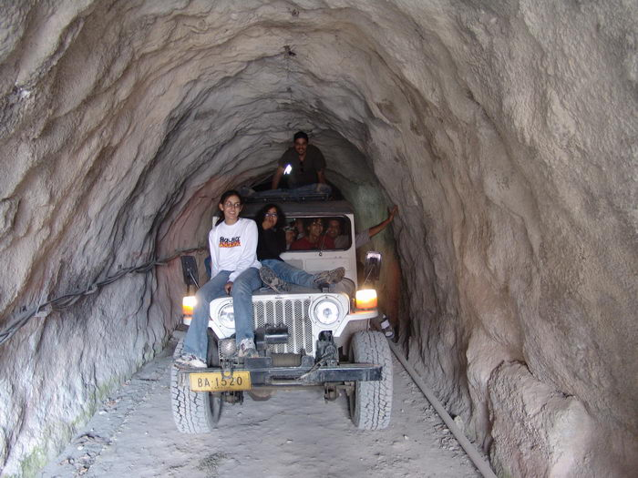

They finally make it back down. We had started to worry about them.

## Comments (6)

**b.t.butt** - January  2, 2005  1:15 AM

dear picture peoples hello , what kind of jeep you own and where in pakistan this tunnel is. thanks for this lovely pciture which i liked

---

**Arsalan Malik** - April 20, 2005  6:09 PM

Where is this tunnel?

---

**TAHA** - July 11, 2005 11:41 AM

ihav been thru all northern parts of pakistan how could i miss this tunnel ..can u tell where is this tunnel...

---

**DR A KHAN** - April 22, 2006  2:49 PM

wow man, i mean looking from here in uk, one is amaized how these places can exist in pakistan, has this tunnel or chitral valley it self hit by that devastating earth quake??
i would love to go to these places if some one posts me the names of these areas once i come to pak.
cheers;)

---

**Khurram Khan** - July 27, 2006  2:03 PM

Hi all,
Its fairly interesting seeing all your pictures these are really amazing, although I have been to Chitral and Kalash "Bhamborate" however somehow I have missed that tunnel.

---

**Ahsan** - September  4, 2006  1:59 PM

Pakistan..... Great Land, Great Places, Great People

---

