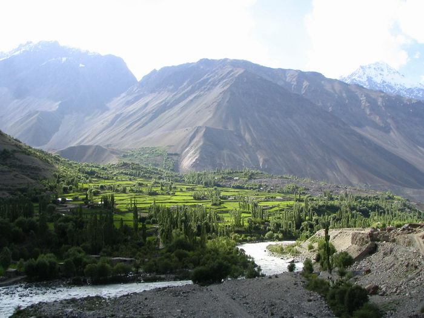

breathtaking view from here. The camera doesn't do justice.

## Comments (2)

**Nour ull Huda Yaftali** - August 28, 2007 10:46 AM

A Panoramic view of Baleem Laspur.Baleem is one of the breathtaking view vally of Laspur.

**KARAM TALPUR** - January  6, 2009 11:55 AM

DEAR NOUR ULL HUDA, YOU SEEM TO BE BELONGING SOMEWHERE TO CHITRAL . WILL YOU PLS TELL ME WHICH IS THE MOST IDEAL MONTH TO VIST SHANDUR AND CHITRAL, KALASH VALLEYS THROUGH CHITRAL-GILGIT ROAD

REGARDS

KARAM TALPUR, ISLAMABAD

