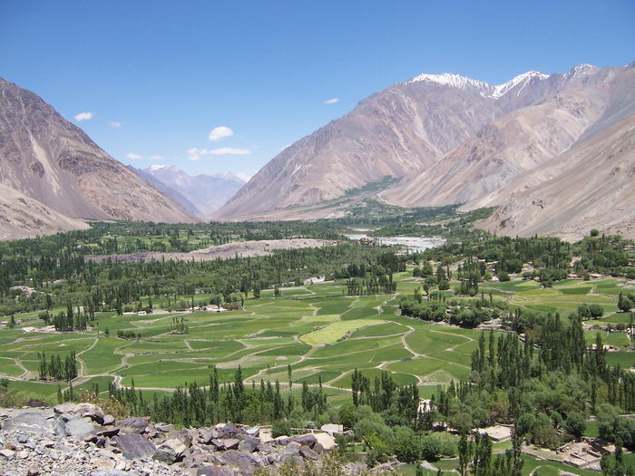

A green valley en route to Shandur.

## Comments (3)

**Mrs Yasir** - December 13, 2004  6:07 PM

AA
I'm here with a request ... Can i use the photographs from ur website in a project tht i have to do..?? Im a student and i have to do a project for my Multimedia course. The project is:"The visualization of Surah Saba"
I intend to use the snaps of sceneries to depict the visualization of "bounties of Allah Almighty" in connection with the above mentioned project
RSVP
Amna Abdul Wahid
& Kiran Mehtab
(BCS semester 7)
Comsats Institute of Information Technology, h-8 campus, Islamabad.

---

**Ismail Faiz** - September 23, 2005  7:55 PM

It was nice to see Chitral pics. U guyz have really done a gr8 job. Specially this Pic of my village is just Owsome,

Regards,

Ismail Faiz
Islamabad.

---

**Nour ull Huda Yaftali** - August 23, 2007 12:49 PM

Hi I am Nour ull Huda Yaftali belong to Yaftali family of laspur i like polo,trekking fishing,Horses ,dogs.
This pic.Laspur taken from Latori Brock.

---

