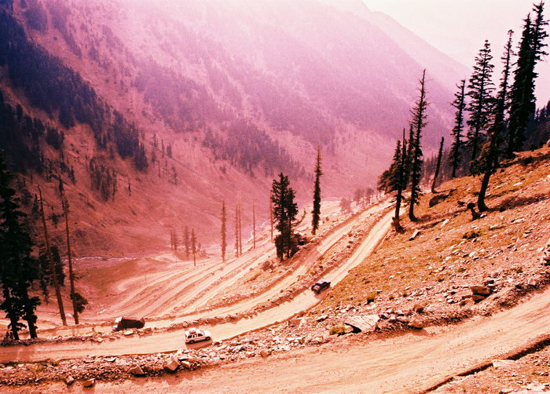

On our way up the Lowari Pass, heading back from Chitral, this is the view of the amazing hairpin turns that run all the way up the pass. Our Lahori Kia Sportage is in the middle. The Nissan Diesel truck further below has a tough time negotiating the turns, having to reverse back and forward at each hairpin. We happened to be stuck behind a bunch of these trucks, and it took us ages to get up the pass, not to mention the noxious diesel fumes we had to contend with. But because the going was slow, it gave us time to take these wonderful pictures!

## Comments (1)

**myra** - April 12, 2006  9:26 PM

Mahera, i look at your snaps and feel that i know you:) they are just beautiful. I am reminded of a family trip to sawat in 2003. This picture reminded me of a drive we had through the mountains and how i felt at one with God's world. Love your website, and I am glad that I stumbled upon it. I hope that I can return to such places in my homeland again soon Inshallah. Keep up the good work!
Myra

---

