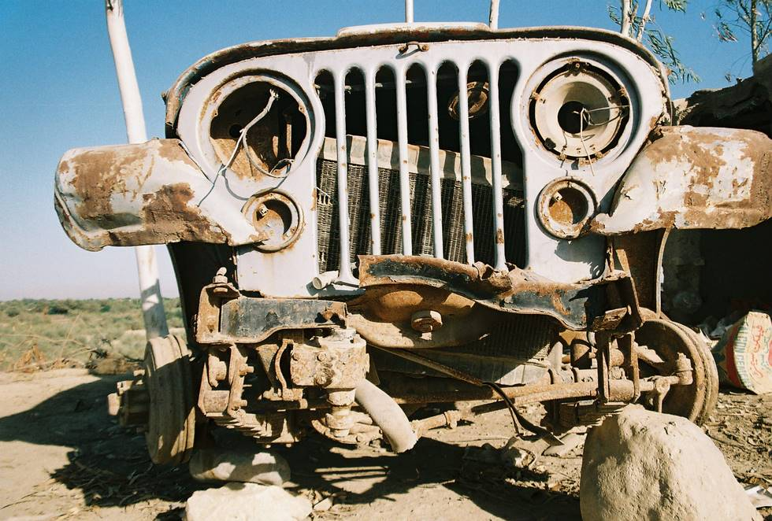

## Comments (1)

**Jonny O** - February 17, 2006  1:49 AM

Buddy, if you're really going to restore that sad sad CJ, please don't.......give her a proper funeral. I've seen it before in my home town of Tucson, AZ......tearing up the desert in my 1965 CJ-5 and coming across a wounding soilder like the one above........i usually dress her up of a coat of oil and say a prayer. Good luck and keep on wheelin!

