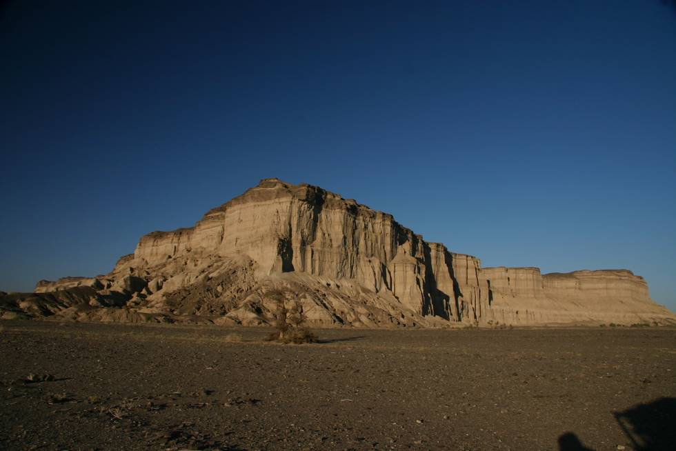

## Comments (2)

**Kahn** - August 31, 2007  6:36 PM

Are you sure this is a mud outcrop? To me it looks like some high ground that has been highly eroded and weathered. The side facing is like a cliff while the opposite descends gradually. The different layer of soil are marked clearly. Beutifully taken pic.

**mike** - February 25, 2010 11:13 PM

what a beautiful pic......... i dream to visit Pakistan.

