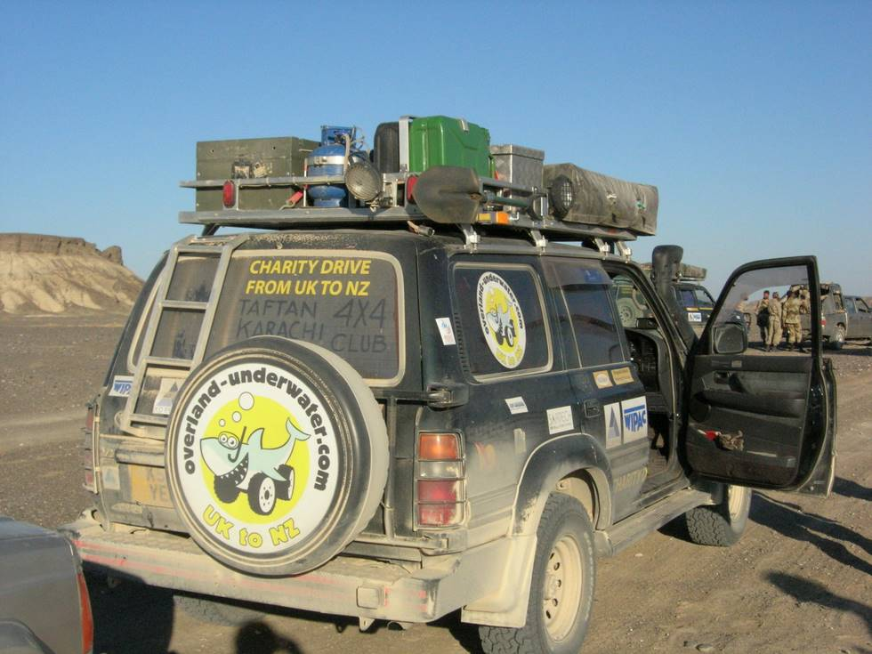

For their adventures, see the overland-underwater website.

## Comments (1)

**Habib-ur-Rehman kubdani** - January  6, 2007  7:47 PM

I am local of Nokkundi Taftan.You enjoyed Taftan trip,because u saw historical placeslike Galuga and Saindak fort but no protection these historical place from Goverment.

