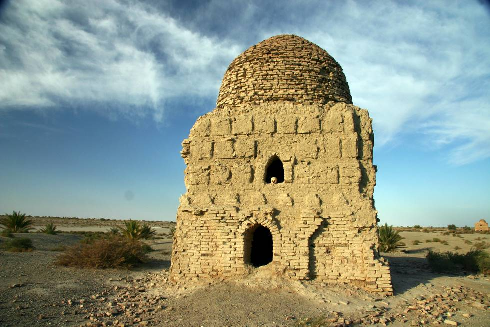

There are just a few tombs here - about 10-12, and a few more which have now in ruins. These are open tombs, with the bottoms laid to rest on the ground. Each tomb has many human skeletons in it.

## Comments (1)

**Cayle** - August  7, 2011 10:47 PM

Times are changing for the better if I can get this oilnne!

