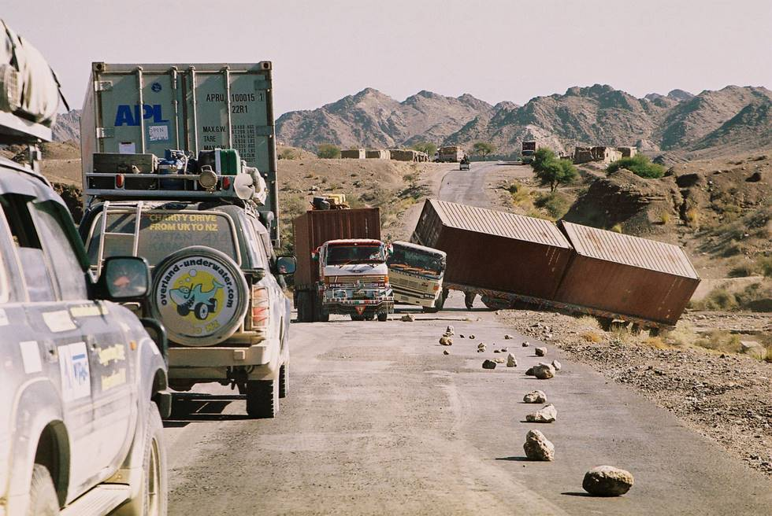

Cars were passing through single file on the left. Luckily no one was hurt. The containers were full of raw bananas headed for Iran. The driver had called a crane from Karachi to pull the trailer back on the road. Accidents like these make the highways dangerous at night, as these stopped/accidented trucks/trailers don't have any warning lights.