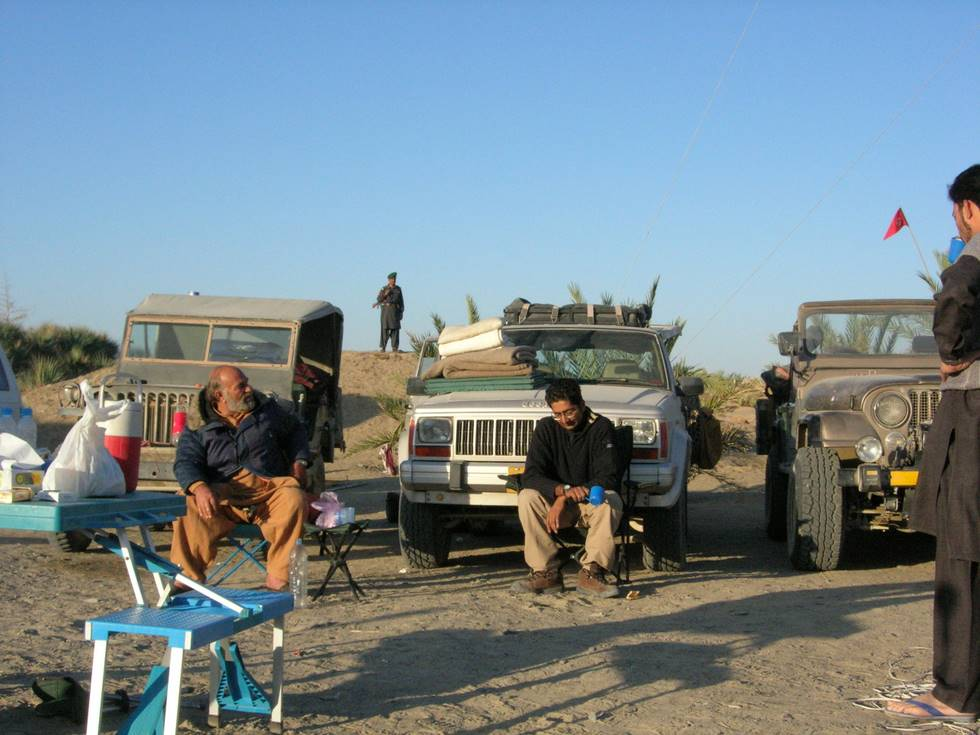

We had a sparse breakfast of tea, parathas (fried bread), rusk, eggs, poached eggs, cheese, susages, honey, marmalade, nutella (chocolate spread), peanut butter, dates, coffee, hazelnut coffee, potatoes, fried tomatoes, pancakes with fresh honey, and mushroom and cheese omeletes, along with a desi style omeletes as well. We saved some items for the next camp.

## Comments (1)

**Kabir Omar** - December  8, 2005  1:39 PM

I think it was a gourmet breakfast in the middle of a desert. You are being too kind calling it sparse breakfast. Be that as it may, but look at the "TAAM JHAAM" as Kaleem Bhai would put it. I will say it was "Total Intezaam" Absolute and toatal security. Wonderful trip.

