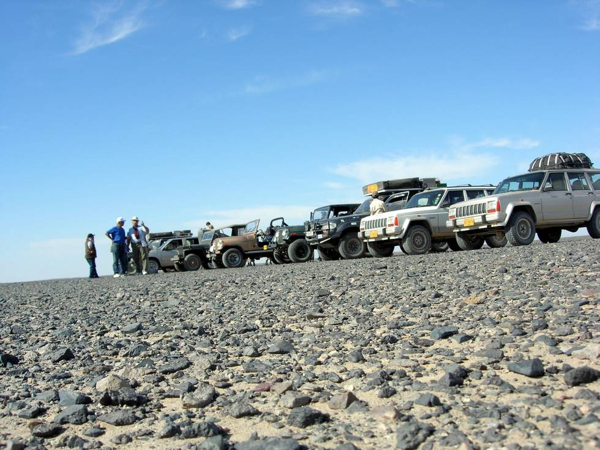

heading towards Qilla Ladgasht.

## Comments (2)

**athar** - August  4, 2009  4:38 PM

READY STEADY GO...
AOA SIR.
IVE VISITED UR WEBSITE FREQUENTLY AND HAVE SEEN THE WAY U PEOPLE GO.
I WANTED TO KNOW FROM U GUYS THAT HOW GOOD THE GRAND SPORTAGE IS AS A 4X4 .IVE SEEN ITS VIDEOS ON NET BUT WANTED RO KNOW FROM THOSE WHO HAVE DRIVEN THEM.KINDLY REPLY ME.

REGARDS ATHAR

---

**athar** - August  4, 2009  4:39 PM

READY STEADY GO...
AOA SIR.
IVE VISITED UR WEBSITE FREQUENTLY AND HAVE SEEN THE WAY U PEOPLE GO.
I WANTED TO KNOW FROM U GUYS THAT HOW GOOD THE GRAND SPORTAGE IS AS A 4X4 .IVE SEEN ITS VIDEOS ON NET BUT WANTED RO KNOW FROM THOSE WHO HAVE DRIVEN THEM.KINDLY REPLY ME.

REGARDS ATHAR

---

