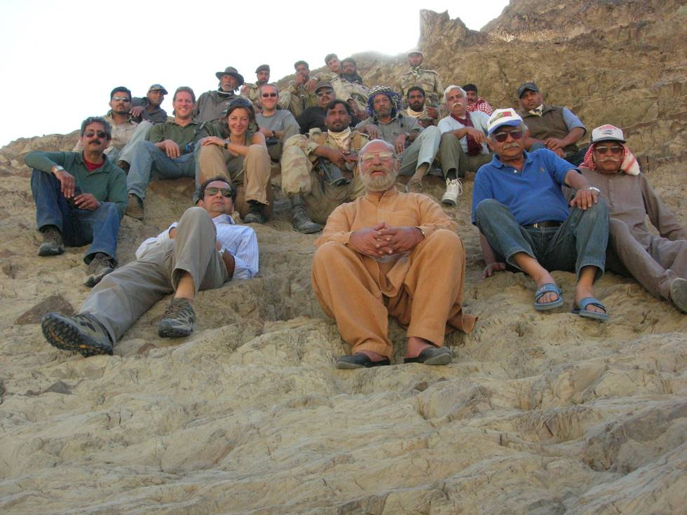

Taken on the way from Plantak to Panjgur.
(Starting from bottom left)
Hamid Omar, Ahmad Omar,Khan Sahib, Kabir Omar, Wazir Ahmed,
(Second row, going right to left)
Obaid, Aamir Bilal, Taimur Mirza, a guide, Marriane Towns, Martin, Salman Ali
(third row, going left to right)
Tanveer, Dr. Mansur, Alex Towns, Hanif Chaudhry (and then other guides).

## Comments (2)

**Kabir Omar** - December  8, 2005  1:30 PM

I have named this rock as "Rock of the die hard offroaders" To get to this photo position it was a vertical climb and sharp edges my "Chappals" didnt much help.

---

**zeeshan rattvi** - December 11, 2005  4:41 PM

hello my name is zeeshan i am 13 years old and i am living in london.I always love to see your photos taken at different parts of pakistan.I liked the above group photo in which people of all ages enjoy life.i am waiting for your next offroad journey photos good bye

---

