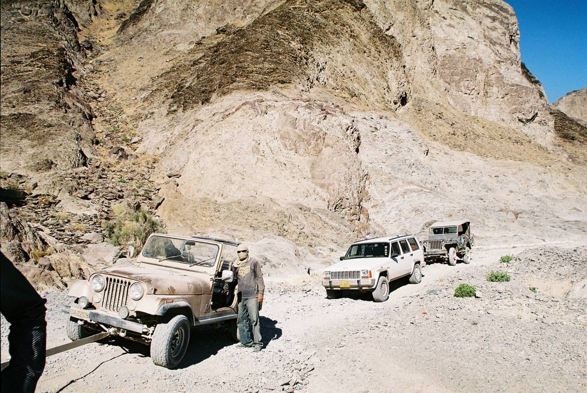

Waiting for the others to catch up here. Photo was taken up somewhere between Plantak and Panjgur.

## Comments (1)

**Imad** - January 23, 2006  8:18 PM

The Not-So-Invisible Man in The Most Hellish Offroad Tow-Trip Ever. As if 350kms 15ft behind a Jeep with 32" tires chucking stones on the windshield, grill and bumper with lightning speed wasn't bad enough, the Jeep's truck ride from Panjgur made up for whatever was missing. Getting towed over terrain that looks like Satan's ass is one thing but sending a vehicle in a truck over it is deserving of incarceration. 3 months later I am still feeling the pinch from the caved-in fuel tank, caved-in & torn cargo bed where the well meaning mechanics just dumped the transmission, and countless scratches and stone chips all over. Heck, dust still falls from inside the dash everytime the Jeep goes over a bump.

---

