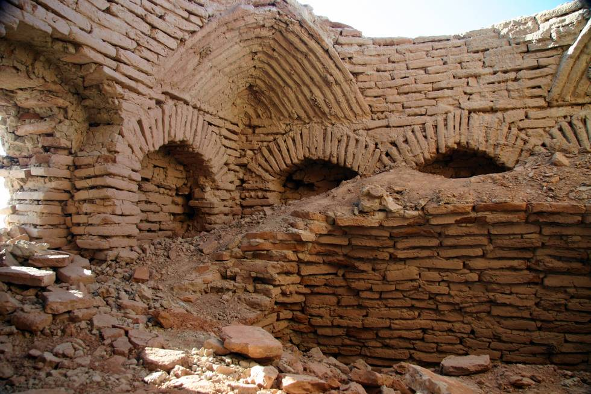

At Galuga, Mashkell

## Comments (3)

**syed adnan ahmed** - June 10, 2006  3:28 PM

sir i saw yrs offroading pictures at yours web site thats nice i like it, just i would like to give you one advise regarding pictures please try to show maximum photos of yours 4x4 vehicles during offroading. I think peoples like to see 4x4 action, I have also jeep that is Willys 1965 M38 total in original condition except engine and gear and I like offroading too, I live in Rawalpindi here in Islamabad my few friends doing offroading in Margalla hills since last few years and PTV made a programme on them in two parts already telecast on PTV few days ago, so I like yours club pics thats very nice, is it possible if you can informe me for your next trip in desert,mountain,lakes and what is the requirments etc etc.. My name is Syed Adnan Ahmed, Mobile No 0333-5138721. whenever I arrive in karachi I like to see you, provide me yours mobile nos and addresses, thanking you best regards reply me i ll be greatfull ...Allah Hafiz

---

**Kahn** - August 31, 2007  6:48 PM

Beautiful snap. Are these ruins preserved? Has anything been done to ascertain their origin? These ruins and others you have shown on your ventures are great tourist attractions and therefore income for the country, also raising the livelihood of people around the area. These abandoned sites must have supported life, some earlier civilisation.

---

**KO** - September  1, 2007  1:59 PM

These ruins are pretty much left to their own devices, ever since the original makers disappeared. There are a number of other ruins in Pakistan, including Mohenjadora, which is possibly the oldest civilization on record.

---

