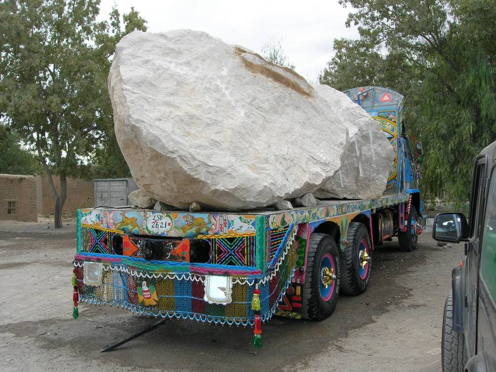

Marble (10 tons!) heading to Karachi from a mine somewhere in Baluchistan. Driving on the RCD highway from Quetta to Karachi you'll come across many of these trucks, including many broken down due to overload.

## Comments (1)

**Lashaar Baloch** - January  6, 2007  7:21 PM

Dear

A beautifull pics but i want more like this pics if avilible than plz send me.I m studint of economic Geologhy so i want mpore information about the marketing of marble.i hope u will co-operate me in this field.
with best wishes
Lashaar Baloh

---

