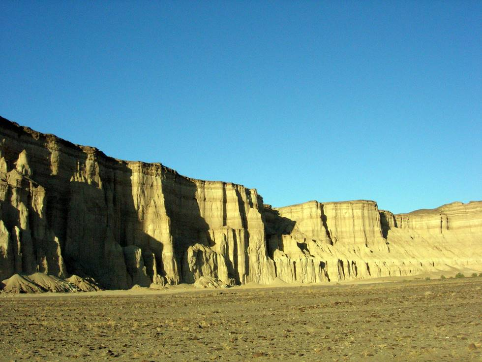

I was busy towing Imad's Jeep so couldn't take any photos of the nicer scenery.

## Comments (1)

**Habib-ur-Rehman kubdani** - January  6, 2007  7:53 PM

This is the view of beauti ful rock named pajgour formation age cretaceous.

