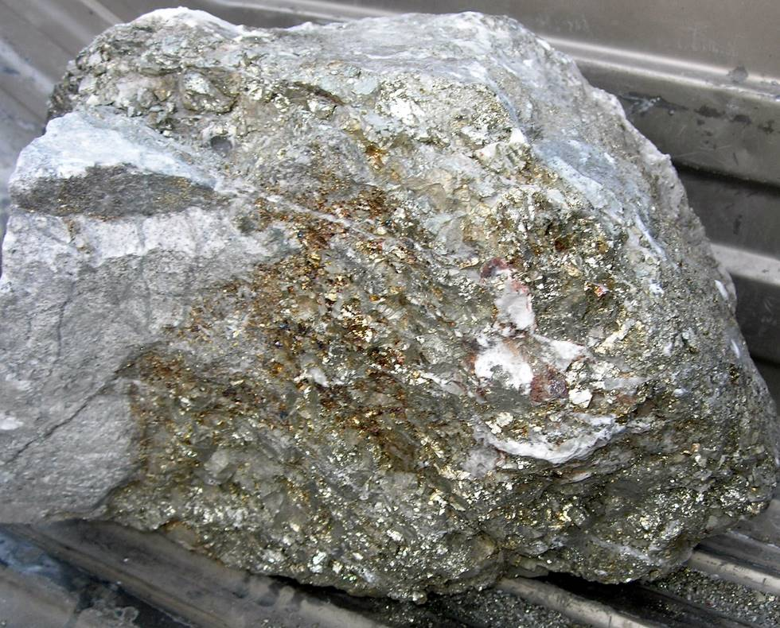

Saindak is the first major mining operation in Baluchistan. This is a picture of a large stone from the quarry. It contains gold, silver and copper. We all took some small pieces of stone from here, which seemed to be mostly metal and less of stone! The Pakistan government estimated some years ago there the mineable deposits are 400 million tons! (That's a lot of gold/copper/silver!) See Expansion of Saindak copper project.

## Comments (5)

**Kabir Omar** - December  8, 2005  1:53 PM

Folks I brought home a huge rock, you guys got little tiny stones. Now to become a millionaire all I have to do is figure out a way to take that gold out. Oh well, I will take it out speck by speck, time is on my side.

**Khadim** - June  6, 2006  4:14 AM

What we see in your big chunk of rock above is the mineral pyrite (Fool's Gold) and not the real gold! Gold in Saindak copper mines is present as a by-product and is only a tiny fraction of the total mass!

**tanya** - December 12, 2006 10:00 AM

Yes its true that majority of this rock is fools gold, something that sparked the gold rush in the US and ruined the lives of many prospective 'businessmen' who spent years digging out pieces of what they thought was gold. Pyrite is special because its metallic luster and pale-to-normal brass-yellow hue have earned it the nickname fool's gold. Ironically, however, very small quantities of actual gold are sometimes found in pyrite as well, for those who want to keep trying!

**Arslan Hussain** - February 27, 2008  2:49 PM

REAL BENEFICIARY OF SAINDAK PROJECT, PAKISTAN or CHINA?
Yaar please leave these pathetic arguments that how much gold and/or silver in 1 tone of blister, the point here to raise is that, unfortunately we have lost control on the high rate of production by MCC's subsidiary (MRDL). If this situation continues to be in future, Pakistan would left with nothing after the end of this 10 years lease contract with MCC. Although the predicted estimated life of the mine was 19 years, so Pakistan should at least have 9 years for getting huge profits from its own resources after the lease contract comes to an end...

**saleem** - January 12, 2009 10:32 PM

Arsalan Please expalin us in layman terms what you meant by MCC's susidary. Can you tell itin more detail as well. thanks.

