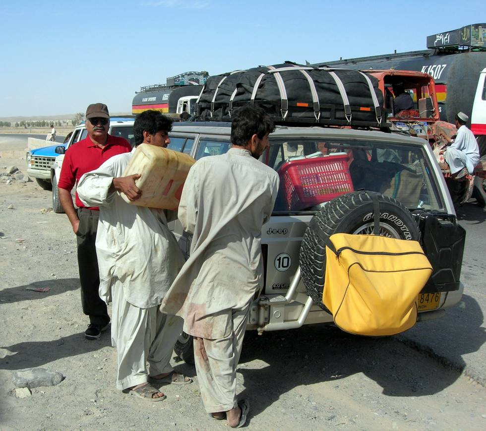

In the more remote parts of Baluchistan (95%) there are no fuel pumps. You get the diesel or petrol in cans at less than half the price of petrol/diesel in the rest of Pakistan. There is a lot of suspended particles in this fuel due to the way the fuel is transported (camelback/pickups through the desert), which can clog up fuel filters and damage the injectors and fuel pumps.

## Comments (2)

**Arif Syed** - May 18, 2006  3:13 AM

Hello,
Going through the pictures and reading about your trips has been very interesting. I was wondering how do you deal with the poor quality of fuel and its effects on the vehicles?

---

**Babloo Mashterr** - May 18, 2006  1:40 PM

You should pre-filter the fuel before decating it into your vehicle, and also use diesel fuel additive to prevent formation of wax deposits in the fuel injection system. If you dont have diesel additive, then adding one litre of engine oil to forty litres of diesel also works well.

---

