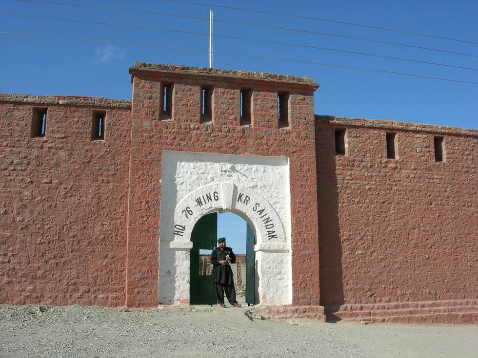

This fort was built by General Dyer, and is now called Saindak fort. It's now the local headquarters for the frontier corps. When we visited the fort they said they have just started to restore the fort.