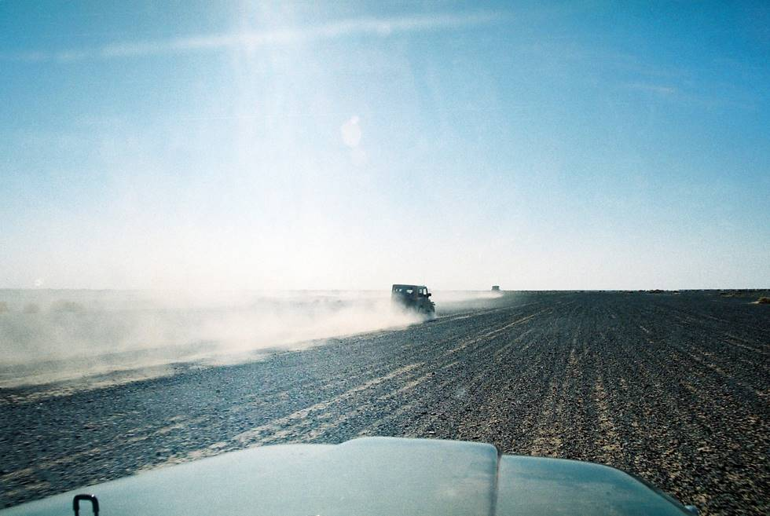

It's wise to have a local guide here, as there are no landmarks - it's a completely flat desert. Everytime it rains, some water collects on the plains, but it drains away in a month or so. While the water is there, migratory birds rest there. We're driving through the middle of the Mashkell desert in this picture.