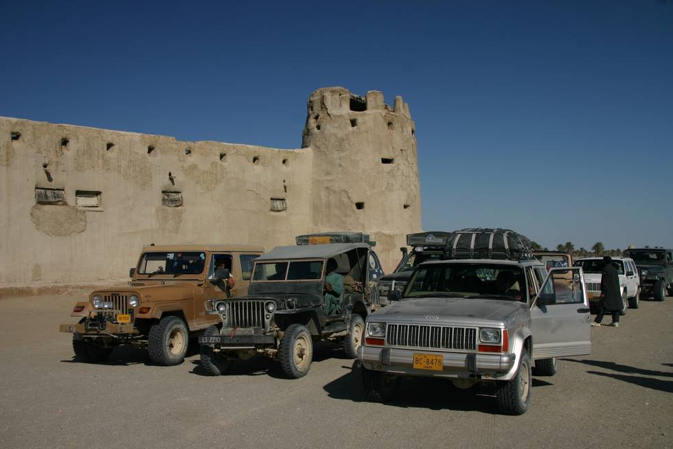

This is the fort at Mashkell near which we had camped. Right now we are waiting for something or the other. (That happens often as we leave camp).

## Comments (1)

**baloch** - February 25, 2010 11:17 PM

there are hundreds of forts all over Pakistan.govt should specify all the the tourist spots.

