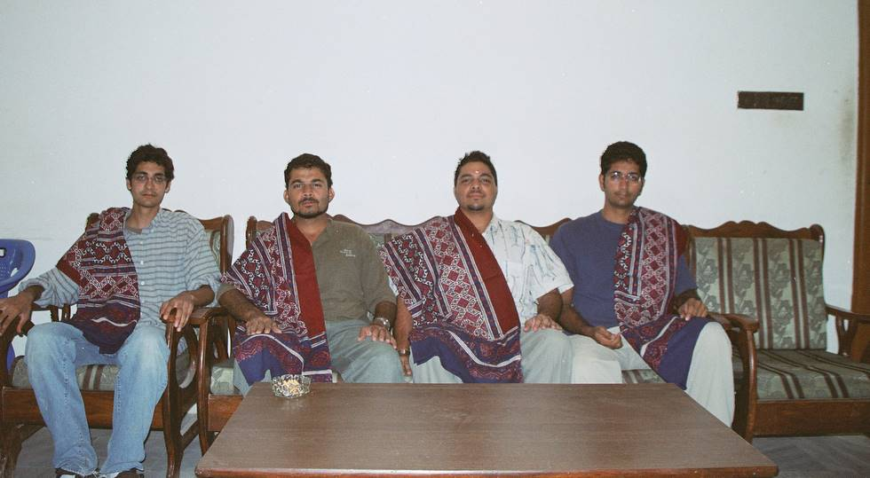

An ajrak is a traditional sindhi block printed garment with geometric or floral designs. The ajraks adorned by us were presented to us by our host Ali Raza Rajar. This is a sindhi custom where the host honours his guests by presenting them with ajraks.

## Comments (2)

**Gobind** - July  6, 2005  2:31 PM

I have left khipro 13 yrs back.Now seeing develloping on all across is my wish.What a beautful bir speices.WOuld love to know more about khipro at recent times.If anyone can help me out.

**Abdul Rauf khan** - March 20, 2006 10:13 PM

Hi visitors me A RAUF Khan here.
Actually i want to say something about the motor rally held in cholistan which is a backward area of Bahawalpur.It is a very good and positive thinking of Organizers.
Such kind of activities represents the healthy nature and bright ideas of intelligent peoples.
Good wishes for all of you

