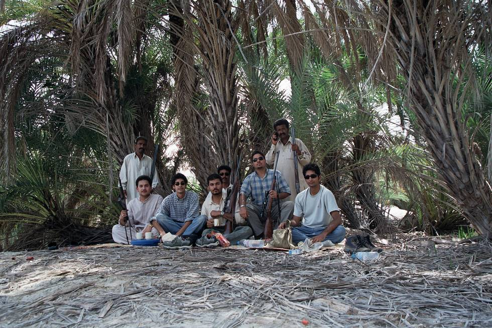

The Manic Militia!

## Comments (2)

**Paul Elliot** - July 19, 2005  1:01 AM

I have been enjoying your pictures, the scenery in Pakistan is spectacular. This picure however, makes me wonder if travel is safe there. (Just joking! :-)) Are you guys on a hunting trip or are the weapons for safety's sake? How hard is it to join the "Manic Militia"?
Cheers!

---

**KO** - July 19, 2005 12:05 PM

Weapons were mainly for posing and target price - we were hunting pepsi cans and nestle bottles.

---

