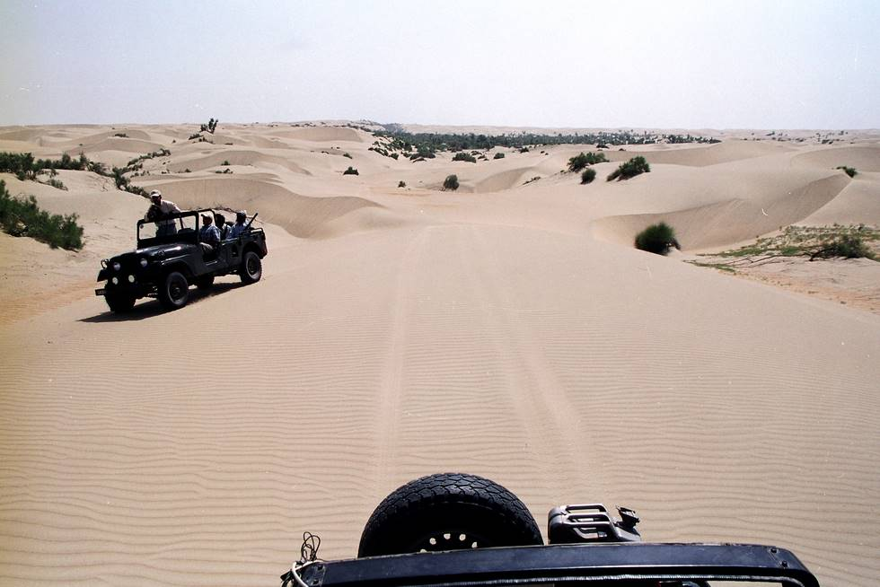

We're well into the desert now, way off the beaten track.

## Comments (3)

**Imad** - October 12, 2003 12:56 AM

This looks like forbidding terrain.

---

**sujo** - November 24, 2008 11:05 PM

It is great adventure of life. I feel very happy to see your pics. I do salute your effort. Can you send me the Pictures of sand and dunes. You have a nice cemera.
regards
Sujo
PhD student
Department of Geography
Loughborough University
Loughborough, Leicestershire
LE11 3TU, UK .
email.s.sujomal@ lboro.ac. uk
sujogeographer@gmail.com
Mob:+44(0)752606033 77
Off:+44(0)1509222797

---

**Adeel** - November 25, 2008  4:58 PM

Hi Sujo,
If u r particularly interested in the sand dune pictures u can visit a few more sites listed here.

dubaidesertclub.com
meoffroaders.com
dubai4x4.com

However its very difficult to figure out the desert terrain in the pictures due to similar colors of depressions and elevations. One could only see it properly with a naked eye only.

At offroadpakistan u'll find pictures of all types of terrain as Pakistan is blessed with mountains, deserts, rivers, sea....etc....u name it and its there. And I've seen one of the best variety and quality of pictures posted on this forum.

---

