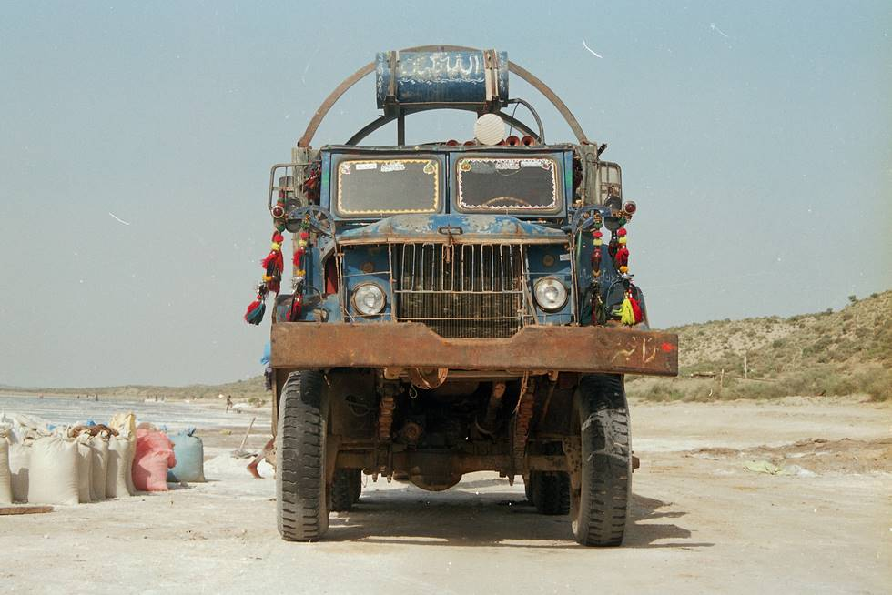

a.k.a. Dodge PowerWagon. This six wheel drive beast carries 2 tonnes of salt through the desert.

## Comments (7)

**Imad** - October 12, 2003 12:53 AM

It even looks like a kaikra. Look at the headlights; they're placed like a crab's eyes.

---

**Naveed Zafar** - November 27, 2005 10:56 PM

Great Picture bros. like to have this mighty Dodge. :)

---

**Tanner** - January 20, 2006  6:07 AM

This is a nice pic. (hate to see one of these on the road)

---

**amar** - January 23, 2006  9:39 PM

Dodge??? What my travels in Thar tell me that these were originally
GMCs ... six wheel drives (they still are, with a very funny way
of driving the rear diffs.) that served in the world war II. Then
the korean war. Then the pakistani army got them from Korea.
And when they finally reached the end of their lives. The army
auctioned them off. And acquired by entriprising thari transporters
to rule the dunes. They can easily carry a few tons on man, beasts
and materials up a shifty sand dune.

---

**Chris** - February 16, 2006  1:27 PM

Saddly to say, this unit is not a dodge at all. I may only be 14 years old but i know my dodges. Amar is right. It is a 6x6 gmc. Or as some would call it, a duece and a half. They still use this beast in the wars today. Only that the ones they have know are 5-10 year old range. But they still use Power wagons today, but only in they airfields in america. The original army dodge power wagon are manly used in air shows for display and even carring bombs to the planes. But since there are less and less power wagons each year they have there on protection in the army. They are only used for things that dont inclued risking the power wagon. I would love to own a power wagon, but since i move to New Zealand 2 1/2 weeks ago, it looks like i have a pritty grim chance of that. You can go to www.imageevent.com/powerwagon and that sight has many selectons of dodge power wagon photos you can look at. My fav would be the swivel frame power wagon. Very rare.

---

**Arthur P. Bloom** - September 15, 2006 10:27 AM

It is not a Dodge. It is not a GMC (model CCKW) or (model M211/M135)

It is an M35 2.5-ton truck.

See my website.

---

**Navin** - December  6, 2007  4:31 PM

All I know its the type of truck that runs over a couple of police cruisers in First Blood (Rambo). Definitely US military issue... look at that approach angle!!

---

