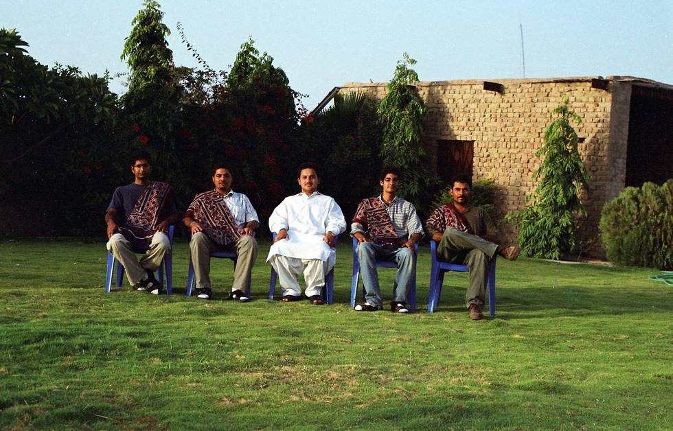

The front lawn at Khipro.

## Comments (2)

**Zain** - April  3, 2005  8:42 AM

Yaar, how did they manage to grow grass in Thar, Isn't it a vast desert. Seems like a private lawn, but the its mind bogling. Must have a great water sprinkling system and soil transplantation from other part of the country.

**Usman Khan** - May  5, 2005  9:19 PM

As salamalaikum,

I have been looking for a long time for the Qaimkhani Qoum, i saw your site and i am wondering if you are a Qaimkhani. If so do write to me. I am a Qaimkhani from Jodhpur, now i am living in Canada.

Usman Khan

