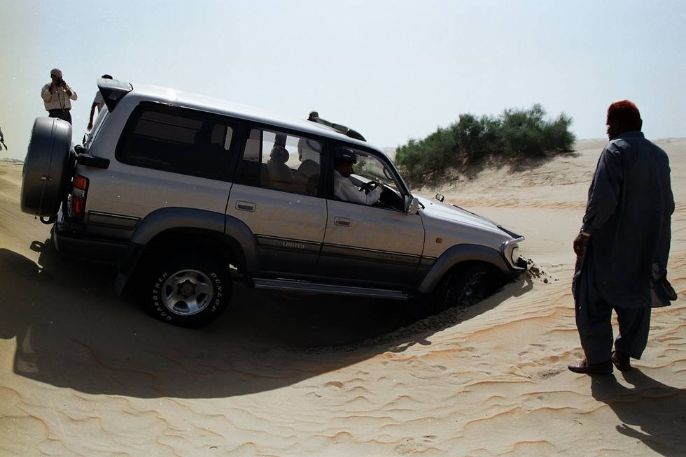

Well and truly stuck.

## Comments (5)

**jess** - January 25, 2005 11:59 AM

did you ever get that out and if you did how?

**Yaseen** - January 25, 2005  2:08 PM

Dear Jess,

The following links hold the answer to your question.

<http://offroadpakistan.com/pictures/thar_2003/m170_towing_out_land_cruiser.html>
<http://offroadpakistan.com/pictures/thar_2003/free_at_last.html>

How ironic it is that just before we embarked on this journey the
proud owner of this "stuck land cruiser" questioned the ability of the
M170 to tackle the desert!

Moral of the story, appearances can be deceiving and Jeeps are truly
the simplest and best offroad machines.

**Harpreet Shergill** - July 27, 2005  7:26 PM

It is clearly visible that the fault lies with the Jockey and not the Camel. My dear it is not a tractor you are trying to get into a low ground and face the vehicle forward without considering the overall wheelbase of your Toyota, with both tyres straight. Always try with one wheel first.

**Imad** - July 29, 2005  2:51 PM

I doubt that Cruiser could have side-hilled down that dune to hit low ground one wheel at a time. It appears to be a pretty steep dune and it's possible the driver might have been afraid of rolling the vehicle over. I agree a different approach would have worked though.

**irshadlodhi** - April 20, 2006  7:53 PM

salam app ki jeep bohat hi pyari hai app ass ko sirf city mah use kero aur off road k lia range rover lo

