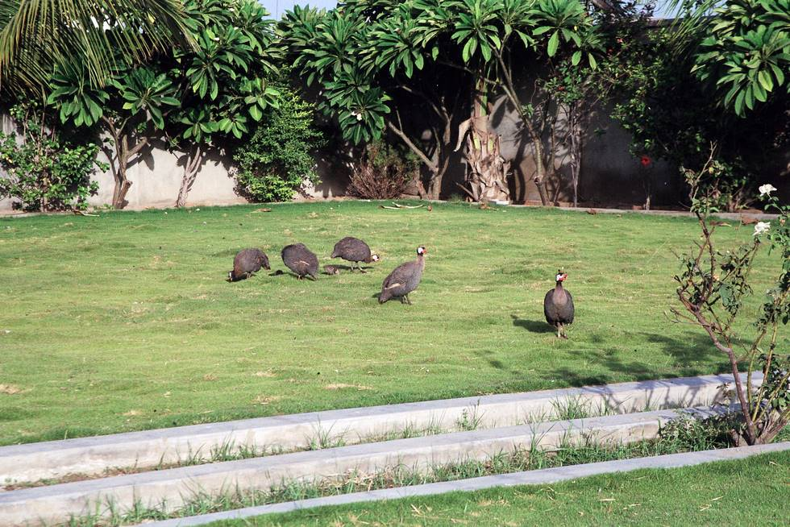

This lawn is home to a few members of the bird family including these guinea fowl aka "chinese murghi".

## Comments (2)

**jimmy** - October 13, 2003  4:50 PM

hi everyone how r u i hope u enjoyed the tour off road with farhan n ali ..

---

**Qaimkhani** - April 21, 2005  8:34 AM

Guys....................Great job, for person like me it brought lot of memory back form child out, my self from TandoAllahyar but growup in Khipro.

Aurangzeb Qaimkhani
Chicago, USA

---

