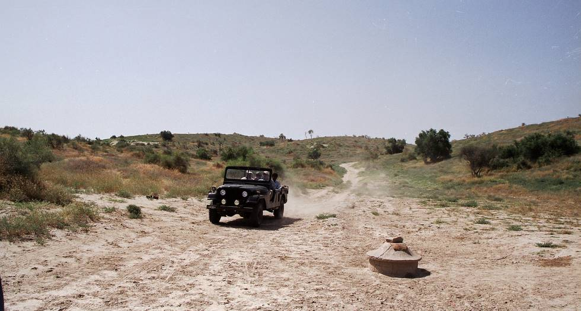

The well in the foreground had water upto the top. It is man made for travellers convenience and collects rain water that flows down the dunes.

## Comments (2)

**abdul hafeez memon** - January 11, 2005  1:24 PM

dear sir i m student of msc. agri.hons
i m doing my thesis work on the topic (assessing well water quality for crops in thar) i need some printed material regarding the topic.i hope u will do a favour at me in this connection and will send such material at my address
abdul hafeez memon,student of MSc.agri.hons,deptt.of soil science,sindh agriculture university tando jam

**Ratan Lal** - August 18, 2006  1:39 PM

dear sir i m student of msc. agri.hons
i m doing my thesis work on the topic (assessing well water quality for crops in thar) i need some printed material regarding the topic.i hope u will do a favour at me in this connection and will send such material at my address
raja memon,student of MSc.agri.hons,deptt.of soil science,sindh agriculture university Karachi.

