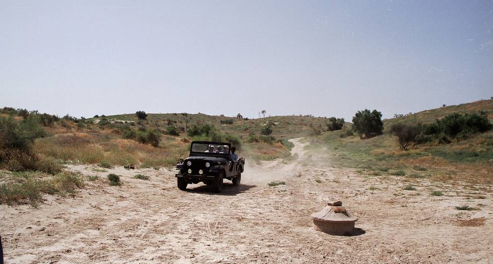

Driving upto a rain water well to quench the Jeep's and our own thirst.
Wells such as this are scattered across the desert to aid travellers and are located in the dip between dunes. Rain water flows from the top of the dunes and collects in the well. The well has sides and a top made from mud. There are small openings on the sides to allow water to trickle in and a circular opening at the top for drawing water. The well is covered to limit evaporation. There is also a canvas or rubber (usually salvaged from old truck tires, conveyer belts etc) bucket with a rope for drawing water.