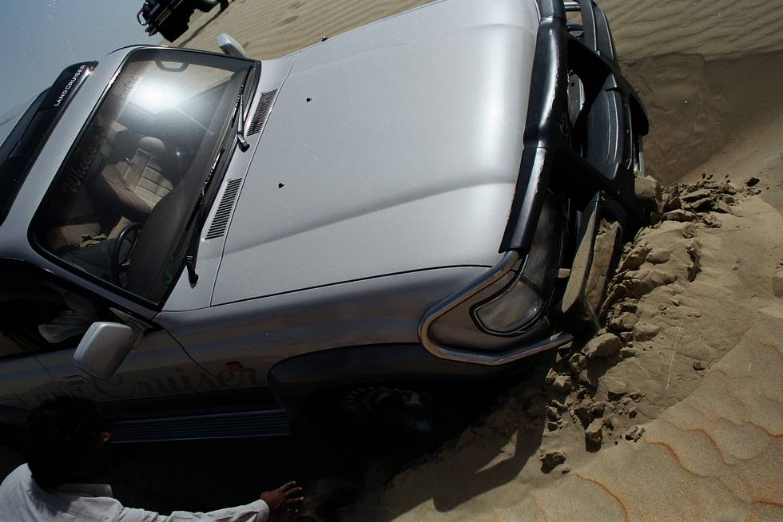

Another angle of the Land Cruiser which had slid down a dune.

## Comments (3)

**Harpreet Shergill** - July 27, 2005  7:19 PM

Actually the Land Cruiser is not at fault, it seems its axles have touched the ground due to bad handling. Otherwise this is not a 4X4 which could really struck like that !!

**Imad** - July 29, 2005  3:06 PM

Just like, "oh it's not my fault - my hands just randomly hit people sometimes!"

**adeel** - November 25, 2008  1:41 PM

This is not a very uncommon stuck in the desert. Doesnt matter which vehicle u drive in the desert u could get stuck. U learn the skills to drive in the desert with more experience but still if someone would say he/she has never got stuck in the desert then he/she has never been to the desert ;-)

