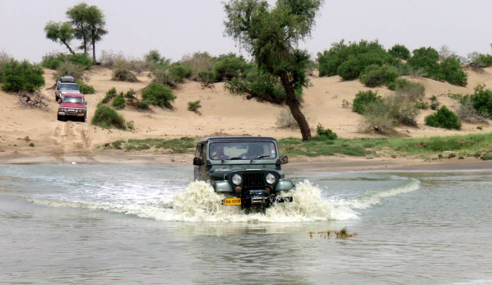

This is a fine example of how not to cross a large body of water. At a couple of points the depth was above the bumper - the high speed caused enough water to enter the air intake that the engine shut off right after crossing the water.