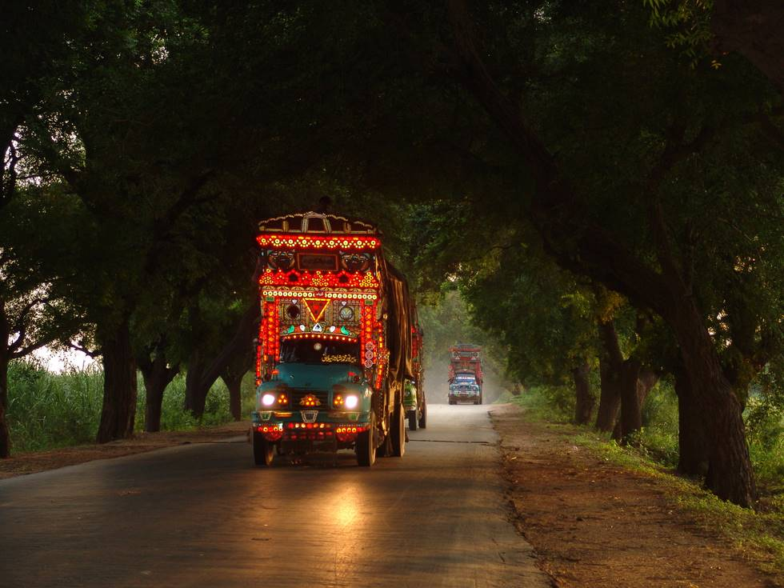

A typical nicely decorated goods truck spotted enroute to Khipro, near Tando Allahyar.

## Comments (5)

**Umar** - December  4, 2006  3:33 PM

This is a beautiful picture of our traditional artistic bedford trucks, now famous for their colorful art through out the world.

**Dr. Pir Abdul Latif** - December 28, 2006 10:56 AM

Umer, it is really a good pic, and this is at pir khati, if i m right. but the best one i think u should have of the khekhras.
amazangly this is the master piece of photography

**Jerjes Talpur** - June  7, 2008 11:00 PM

i think it is tando alahyar and tando adam road?

**kushi** - June 23, 2008  2:28 PM

salam all user
it is really a good pic, and this is at pir khati, if i m right. but the best one i think u should have of the khekhras.
amazangly this is the master piece of photography
me email more beautiful pic www.shingraf1@yahoo.com
me contacet 03345762996

**Danthay** - April 28, 2012  9:59 PM

It has taken me a little while to fiugre out how this camera works the best. I have been taking pictures of the flying squirrels who come into my yard to feed at my bird feeders. So far pictures are OK, but not super, although my subjects are pretty small. I have the camera about 10 feet from the tree. I have yet to try this on deer. Batteries holding up real well, and downloading pictures is a snap. Programming is easy and camera seems pretty rugged. I could have paid 50-75 more for additional features and more pixels, but this will probably meet my needs.

