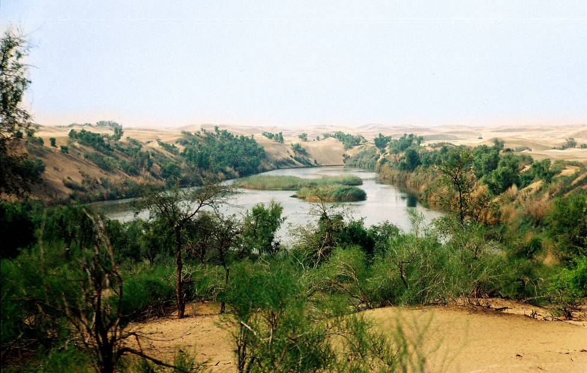

This is a permenant, year around lake in Thar, 20 km from the Indian border.

## Comments (8)

**Sanjay verma** - September 28, 2006  5:48 PM

Hi Dear,

thanks for nice photos and I am an Indian from Pune. I like your efforts very much, Please do send me more photos from pakistan as I like very much.

I wanna to visit pakistan in my life.

Regards

Sanjay

**Mehtab** - October 11, 2006  1:45 PM

Sanjey most welcome whenever u like to visit pakistan espacialy Sindh :)

**habib shadab khan** - December  9, 2006  2:42 PM

Hi Dear,

thanks for nice photos and I am an Indian from Pune. I like your efforts very much, Please do send me more photos from pakistan as I like very much.

I wanna to visit pakistan in my life.

Regards
habbi

**marry** - April 12, 2008  7:02 PM

Ohhhh that's great images in Pakistan i couldn't believe that it's all paradise in Sindh - Capital state of Pakitan it's really owesome make me crazy about the places to visit. actully i am from Romania and i like Paskitanies traditional and it's cultured cities like sindh. I wish that i could have visited the cities like karachi.

Wanna be freind i may

**Nisha** - May 12, 2008  4:32 PM

I feel nostalgic seeing the beautiful places in Pakistan.
Its my dream to visit there at least once if not more than that .
Please keep on adding new pics.

**arslan** - May 16, 2008  6:11 PM

hahhahhahhah very great pic

**Roma** - June 18, 2008 10:09 AM

hi...the pictures you guys have taken are awesome...sheer beauty...could you guys please give me some details about your trip...how you had planned on your itinerary etc. it takes how long to get there and to go through which route..thanks..

**KARAM TALPUR** - December 24, 2008  2:42 PM

HOW UNFORTUNATE IS THIS THAT BEING A SINDHI I HAVE NOT BEEN TO THESE PLACES LIKE THAR . THAR IS INDEED PARADISE ON SINDH'S LAND

