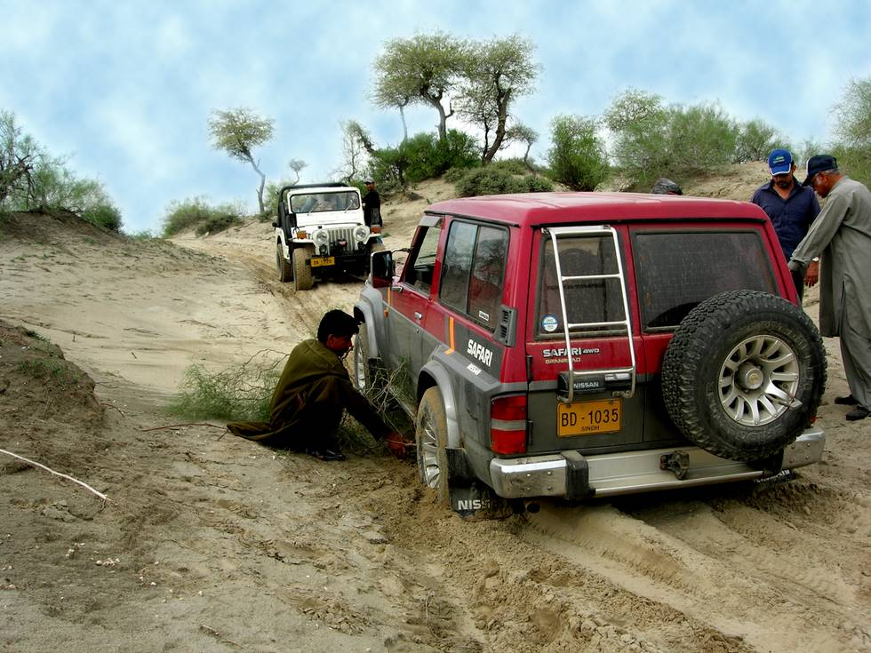

The M38 is lined up to tow the nissan out. While not apparent in the picture, the Nissan stopped on an incline, and so got stuck here.

## Comments (3)

**Fahad Ali** - August 26, 2006  9:41 PM

I always feel very proud whenever M-38 is pulling Luxuary Jeeps Like Nissan Patrol or a Toyota Land Cruiser.
Jeep means "JUST ENOUGH ESSENTIAL PARTS".M-38 is one of the best 4wd machine which have all the enough essential parts.
But its an old saying its not the machine "ITS THE MAN BEHIND THE WHEELS"
That is why M-38 was awarded with "VICTORIA CROSS" in 2nd wolrd war.
Long Live Willys, Long Live off road Club Karachi.
Guyz keep the off road work coming.

Regards,
Fahad Ali

---

**Saad** - September  5, 2006  1:00 PM

Dear Fahad,

Be corrected that M38 was produced AFTER WW2

---

**Arif Amin** - April  9, 2010  1:32 PM

Hi guys,
I am looking for a Range Rover LWB 91-95 models preferable in original petrol engine. Do anyone has any information regarding anyone selling RR?

---

