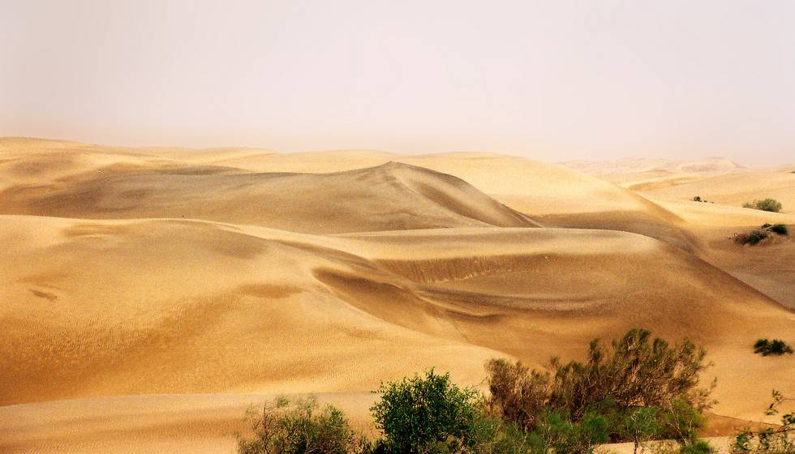

The view from the campsite in the morning.

## Comments (2)

**Fahad Ali** - September 27, 2006  9:18 PM

khalid,
You are a true photgrapher.Man this pic is a beauty.U captured the desert very beautifully in your camera.I love desert & Inshallah I will b with u on your next tour to Thar.
Great shot brother.
Regards,
Fahad Ali
Isb

---

**syed javed husain shah** - November  8, 2008  6:44 AM

I THANK YOU ALL FOR THE THAR DESERT PICTURES AND VIDEO. THIS REMINDS ME OF THE 1971 WAR THAT I FOUGHT AGAINST INDIA. I WAS A YOUNG MAN AND WAS PROUD TO FIGHT ALONG SIDE THE
HUR MUJAHIDS AND THE RAJARS.I WAS SPECIALY FIGHTING THIS PART OF THE DESERT ABOUT A IOO MILES FROM HATHUNGO. I LIVE IN USA NOW AND THESE PICTURES BROUGHT MY MEMORIES BACK.
THANK YOU ALL AND MAY ALLAH BLESS PAKISTAN AND BRING PEACE TO OUR COUNTRY.

---

