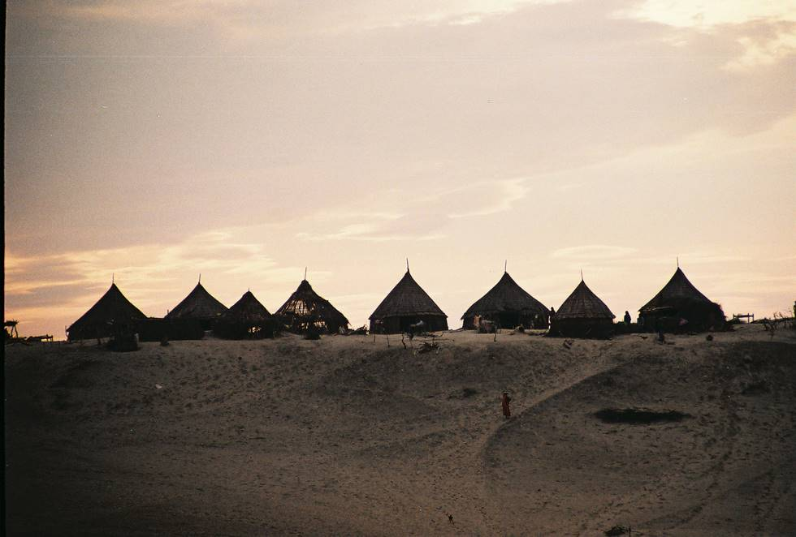

## Comments (2)

**KARAM TALPUR** - December 24, 2008  2:28 PM

ITS ONE OF THE MOST TYPICAL VILLAGES I HAVE EVER SEEN. I MYSELF BELONG TO A VILLAGE AREA IN INTERIOR SINDH BUT THIS IS VERY NICE VILLAGE TO LIVE . I THINK THERE MIGHT NOT BE ANY GREED KNOWN TO THESE PEOPLE BECAUSE I DONT THINK THEIR MIGHT BE ANY FORM OF MODERN MEANS OF COMMUNICATION AVAILABLE WITH THEM.

THIS IS INDEED THE MOST INTERESTING WEBSITE I HAVE SEEN TILL TODAY.

**Bekircan** - April 28, 2012 11:51 PM

RE: Are you making an arneumgt to diagnose and regulate predatory manufacturer/sellers, defined loosely as those who steal market share thru means you deem improper like exploitation of captive labor markets and then selling at what would otherwise be below cost thereby destroying the ability of other manufacturers to compete and survive in the market place? And here I thought you were a lazy faire (cheap shot pun on small government) kind'a guy. I'm not sure if I feel cheated or I want to nominate Scotsman as the new Obama Czar for International Fair Competition and Consumer Protection.The cheap Chinese plane issue is like the bad Chinese drywall issue except the damages from the defective product will be a lot greater. In China, if your relative dies in the crash of a Chinese built airliner, I doubt that their tort law system affords you much if any remedy. Here, the market force mechanism for protection of consumer quality is tort liability. Its funny to think that the Chinese will be able to produce at a lower cost because there probably is no cost for tort liability in there system (of at least no where near as big as our cost). In China, if 5 of their planes crash due to design or manufacturing defects, that's probably an increase in demand for 5 new planes. In the US, the tort liability and potential punitive damages could probably bankrupt the manufacturer in the name of consumer protection.The externalized costs like cheap labor, limited environmental compliance, little if any intellectual property protection and little or no tort liability (among other things) mean that the Chinese can produce more cheaply and destroy our manufacturing base by stealing market share. I personally think US tort law is out of control but I also like free trade. Negotiating and enforcing free trade agreements is extremely complicated and very difficult. If I were king, I think I couldprobably fix the long term debt problem without completely destroying the economy, but I'm not sure how to implement economic globalization without a lot US unemployment and diplomatic fights over what constitutes externalized costs and unfair competition in emerging economies. I think those externalized costs are the true pitchforks that will allow the barbarians at the gates of the US empire tear down our standard of living. The irony is amazing. The masses of humanity are invading us with cheap goods that are destroying our job base and our economy. It's the converse of the old line from the Bible about giving a man a fish. The emerging markets will give us cheap fish until we have no more boats. Then we'll really be their b!tches because our ass is the only thing we'll have left to sell. Rate this comment: 0 0

