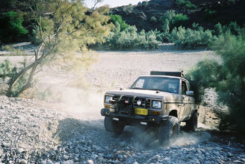

Bronco driving up a dry river.

## Comments (2)

**Masood Ahmed** - October 25, 2004  2:09 PM

Balochistan and Sindh, the uuder discovered , under explored regions of Pakistan offer some of the most thrilling and arduous adventure opportunities of the world. The picture proves this statement.

**KARAM TALPUR** - December 31, 2008  2:03 PM

I AGREE WITH MR. MASOOD AHMED. NOW THIS IS HIGH TIME FOR ALL THE TOURISM AND NATURE LOVER TO GET UNITED AND MAKE CONCERTED EFFORTS TOWARDS PROMOTING TOURISM IN BALUCHISTAN SPECIAL COASTAL REGION AND INTERIOR SINDH AND ITS KHIRTHAR MOUNTAINS

