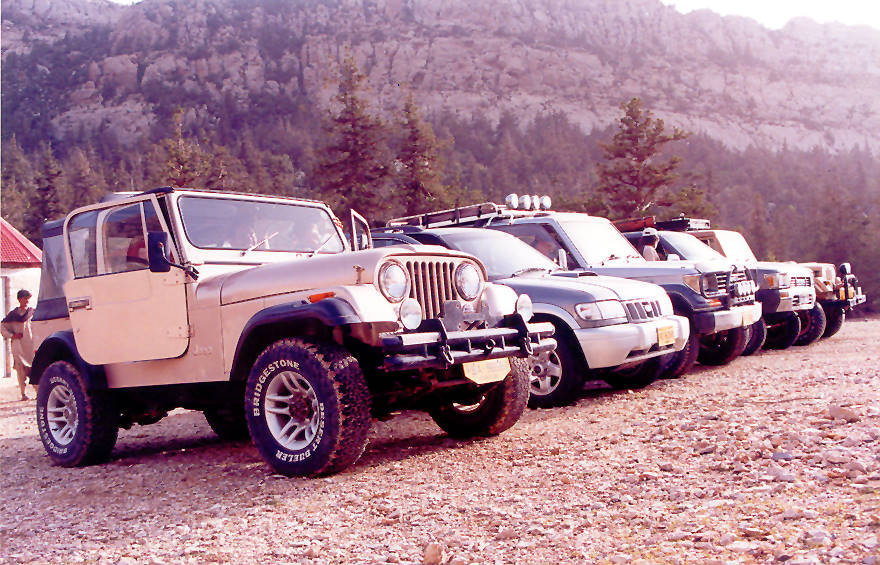

All the Jeeps/SUV's but one lined up.

## Comments (4)

**Salman Ali** - June 30, 2003 12:18 AM

There are only two Jeeps in this picture - one at either end. The rest are all wannabe 4x4s!!!! :P

---

**Vikram Rao** - September 26, 2003 10:22 AM

Great Website, love off roading, I used to live in Massacheusetts where I had a pick up, loved it. Im hoping to move back to India, and hopefully with better political conditions bring across a few Scorpios and Safaris and hit the trails with the CJ'S and Landcruisers

---

**Javed** - December 25, 2003  4:04 AM

Thanks, It's been 10 years since I left
Pakistan. I grew up in Quetta, and have been to Ziarat numerous times. These pictures bring back a lot of memories. Maybe someday when I'll move back to Pakistan, I might join your club. Michigan U.S

---

**Mohammad Khan** - January 18, 2006  9:47 PM

May I suggest the Sulaiman Range as a possible future excursion, mainly because I want to see the pics of what that area looks like ;)
Welwyn Garden City
Uk

---

