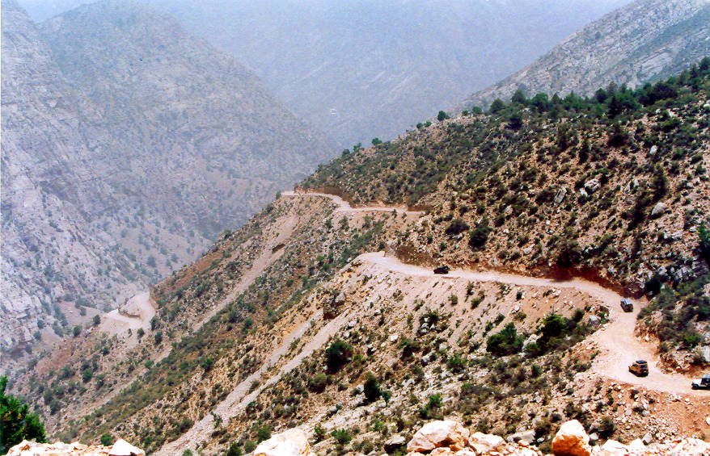

Going from Ziarat to Dozakh Tangi.

## Comments (11)

**patricia** - July 17, 2003 10:37 PM

Here we go on our way to a beautiful lake where we can lay back and relax with a good book! How awesome can this be?

**Amir M. Dutani** - October 27, 2003 11:53 AM

This is not the way to Dosakh Tangi, but to Kharwari Baba Ziarat.

**Imad** - October 29, 2003  5:46 AM

I am pretty sure this is the way to Dozakh Tangi. Kharwari Baba can be reached before the end of the track but Dozakh Tangi also involves a looooong hike after the track ends.

**Yaseen** - October 30, 2003  4:01 PM

This is the track to Dozakh Tangi and at this point we had crossed Kharwari Baba.

**KO** - November  1, 2003  3:04 AM

Kharwai Baba is way back on the road to Ziarat, this picture is many miles up from it.

**RadarBlip** - August  5, 2005 11:50 PM

What a name, Dozakh Tangi. Did anyone ask the locals if any legend exists for this name?

**Yaseen** - August  6, 2005  7:14 PM

One doesn't need to ask the locals to imagine why it has been named so. The valley descends into the Sibi desert, which is one of the hottest places on the planet and the route into the valley itself is not for the faint of heart.

**Imad** - August  6, 2005  7:14 PM

The drive itself deters most people from going out there. Those who think a dirt track leads down in there find a darn near impossible 2 hour trek waiting for them as the track ends abruptly. From there on it becomes quite obvious why there is no track. Nothing could possibly be built in a place with near vertical canyon walls and boulders the size of houses. The descent into the canyon is steep and one needs to be as surefooted as a mountaingoat not to slip and fall. At least one pair of brand new sneakers was destroyed during the trek. The proverbial pot of gold at the end of this rainbow that took us down into the tangi were the springs. We thought we'd drive into the tangi like we'd done with the others before, take a dip there, and have lunch. Yaseen might want to share his experience with the lunch from here on ;).

**bilal** - August 25, 2005 11:03 PM

hi kaya hail ahy salim kay may tum se pakistan key maloomath hacel kar sakta hoo to mara emil hay bilalgul20032000@yahoo.com to tum mugh se ack din online ho kar bathio to kal rath das baon line ho or apna emil do marbhane

**sadiq kakar** - October 24, 2006  2:43 AM

well i hope that would be the most beautiful scene not to see but to feel . i m sadiq khan batozia from loralai balochistan pakistan and i love that scene

**Akhter Ali** - October 18, 2008  7:45 PM

I remember this track very well. I was lucky to travel this one of the most beuatiful scenes in the world. I was on this track during 2003 along with my two other collegues. The feelings are impossible to express in words. The apple we eat there were really delicious and I have never eaten like such apple in my whole life. I would love to travel on this way many more times if I have chance......the calmness, tall hills, apple and cherry gardens, plus a bit thrilling way all creates an environment ever to be remembered as incredible..........

