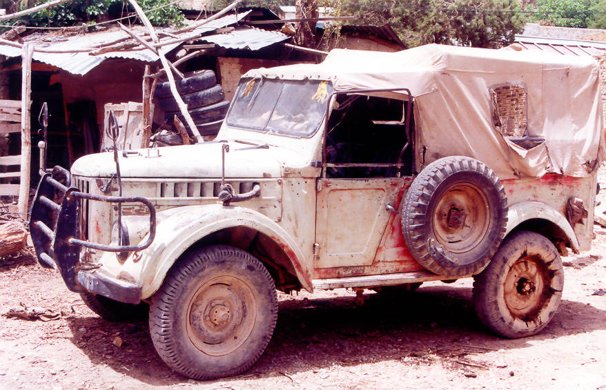

A relic of the Afghan-Russo war. We found this decrepit vehicle at Kharwari Baba, enroute to Dozakh Tangi.

## Comments (2)

**Rimio** - August 28, 2006 12:46 AM

This baby is a Romanian ARO IMS ! Quite a trophy winner at it's time ... Too bad the factory just went bankrupt a few years ago ...

---

**Manmohan Singh Bhogal** - July 25, 2009  5:45 PM

Hi, I am a die hard fan of Jeeps & own a Cj3B from army disposal which I restored to a mint condition with all the neccessary gear for offroading, like power takeoff winch, all terrian tubeless tyres ( imported from U K), stainless steel fuel ( petrol) tank etc. I keep visting your site again & again & enjoy everytime more than the last time. I think the vehicle in this picture is Russian VAZ, coz we too have some of them here in India restored immaculately by their owners. Even I wanted to own one but never got to lay my hands on. Anyway, Happy offroading to the team for many years to come. This is the best way to explore your land.

---

