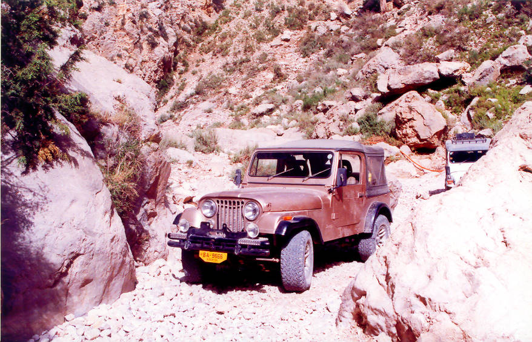

Salman's CJ7. This is on the way to Chauthair Tangi from Ziarat.

## Comments (4)

**Imad** - July 14, 2003 11:56 AM

Fun drive to Chauthair Tangi. Finally got to flick that lever to 4-low and do some real 'wheeling. This turn was pretty tricky - these two boulders pinched the apex of a tight turn and the over hang of the CJ's bulky front end made it difficult to judge exactly how close we could get without getting massaged by the rock

**Taimur Mirza** - October 18, 2004 10:55 AM

Salman, The person who built this CJ7 originally, Fakhri, passed away recently, he was a good friend and a shikari, loved Jeeps and over the years had re-built a number of good vehicles, please recite sura-e-fateha for the departed soul.

**WASEEM** - May  6, 2005  4:48 PM

Nice pic i love 4x4s (but never owned one ;-) )
:-( i miss my country!!!!
i am living in Africa (lovely place to be) but i miss my Pakistan!
i have a job here buss or kuch nahi khanaa yaroo.
mauj masti karo.
Love
Waseem!

**Mamoon Rasheed** - October 17, 2011  2:29 PM

I Have (Willy Jeep 4WD 2400CC engine from USA)
I Love Pakistan

