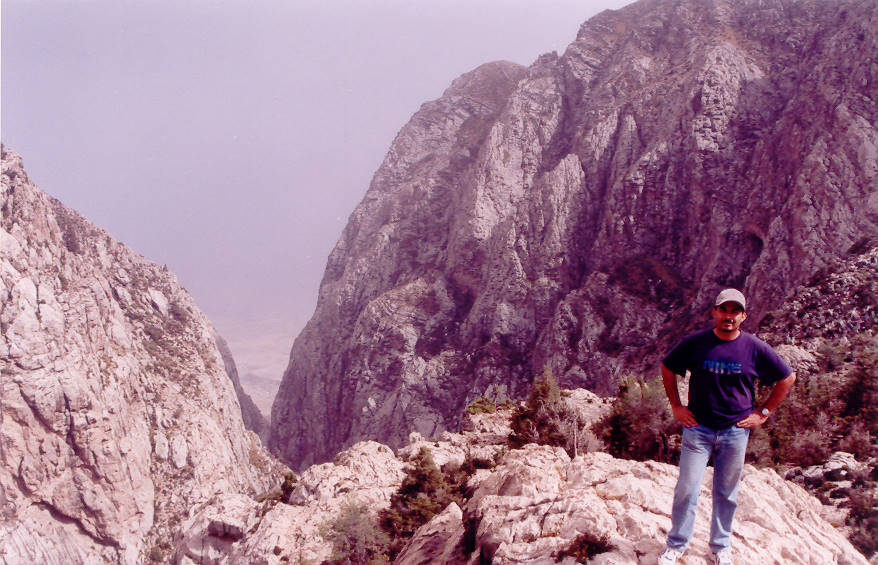

You can see the Sibi desert from here. Up here it was slightly chilly while down below the weather was close to 50 degrees Centigrade.

## Comments (3)

**Arifa** - June 23, 2003  7:48 PM

Salman the picture would have been nicer without you blocking the view btw you look fatter in it. ;P

---

**jairam dass** - April 29, 2006 12:53 PM

well& good Really I impressed now today I am from udai pur rajhisthan (india).

---

**HASSAN ALI** - January 20, 2009  4:57 PM

Great place to visit,Specialli in Snowfall,but the chill there ,My GOD

---

