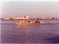

 Sir, in December 2008 it will be the 30th anniversary of the historic “Indus River Expedition”. This Expedition of three people started from Amb- Darband, upstream of Tarbela Dam, and covered 1,600 miles in 30 days right up to the *“city of lights”* – Karachi.

This is the first successfully completed boat journey down the River Indus from Amb to Karachi. The total trip covered 3000km, at an average of a 100km per day.

The Expedition traversed through rural Pakistan at its roots and saw the people in their sincerest form. The experiences, fun and incidents are memorable. Camps were set up along *‘patans’* (ports) along the way and the evening discourse with the village folks and the story telling can never be forgotten. We saw cave dwellings in Makhad Sharif, *‘mooli’* (white radish) the size of men in Kalabagh, the huge river cargo boats being towed along the shore in upper Sindh.

The fun loving blind dolphin accompanied us right up to the Sukkur Barrage. Unfortunately, they are unable to come downstream due to absence of a fish ladder. Like true Moenjodarians we got off at the port and went into the ‘city’. How ingrained in history we felt! We saw the mighty Indus in all its fury at Attock and then as a tamed stream often running dry in stretches downstream of barrages. We saw the colors of the Indus change and mingle with the swift waters of the Kabul River and then the *‘Punj Ab’* (Panjnad) at Mithankot and then the finally depositing its rich silt in the Arabian Sea at Keti Bunder. The headgear of the riverside folks translated from the starched *‘pagri’* in Frontier to the drooped one in Mianwali. The regular full head cap in Punjab got a mehrab style cut and a lot of color in Sindh till the headgear completely vanished near the coast. The friendliness and hospitality all along the way can never be forgotten.

The voyage became historic as it was the longest recorded voyage on the Indus – the closest one was in 510BC by the King of Persia, Darius and his army. There were 5 attempts since then but none was successful. The 30th anniversary would be a good occasion for another attempt! It would be great if our youth comes out and sees the vibrant Pakistan in all its glory along the giant Indus – or should we call it the River Sindh – as the river side people call it along its entire length.

Anyone ready to take the challenge!

**KM Ali**

Team Leader, Indus River Expedition ‘78

Seattle, USA