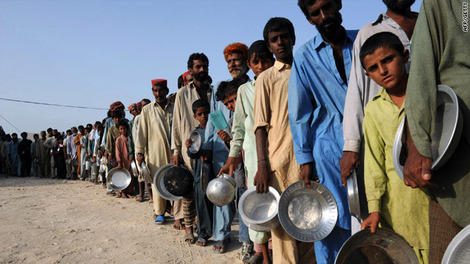

[Holly Yan of CNN caught up with our 2nd relief trip on August 24th](http://edition.cnn.com/2010/WORLD/asiapcf/08/24/pakistan.floods/index.html) and spoke with Offroaders [Awab Alvi](http://teeth.com.pk/blog/) and [Faisal Kapadia](http://deadpanthoughts.com/):

> (CNN)—“Everywhere we go we see eight to 10 feet of water,” said Kapadia, who traveled through inundated villages between Shikarpur and Sukkur. “All we see are the tops of houses.”

Just a month ago, Kapadia was a recreational rider in the 4×4 Offroaders Club of Karachi. He didn’t expect to use his off-roading skills to deliver life-saving supplies to flood victims across nearly impassible terrain and waters.

“We never thought of that,” Kapadia said. “But when you see things happen like this, you can’t just sit on the side and watch thousands of people die.”

So club members, family and friends raised money for supplies to the neediest survivors.

So far the 4×4 Offroaders Club of Karachi has distributed 100 tents and about eight truckloads of food.

Photo credit: CNN